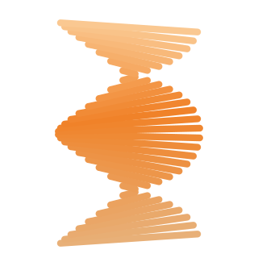

# HYDRA5X

**Chaîne logicielle pour imprimante FDM 5 axes à plateau rotatif-inclinable
(TRT).** Linux, macOS, Windows.

Fractal fournit la mécanique. HYDRA5X fournit ce qui manquait autour : les
dépendances réelles, le slicer réparé sous Linux, l'enveloppe angulaire
mesurée, les profils DXF pour devis.

**État : chaîne logicielle validée, machine non construite.** Tout ce qui
suit a été établi sans matériel — par lecture de code, calcul et exécution.

**Démarrer** : [`docs/install.md`](docs/install.md) — de zéro au premier
G-code en 15 minutes, avec la valeur attendue à chaque étape. Les mesures
ont été faites sous Linux ; le tableau des plateformes y dit précisément ce
qui est vérifié et ce qui ne l'est pas.

---

## Ce qu'il y a d'utilisable ici

### `tools/export_dxf.py` — profils DXF depuis un assemblage STEP

Le seul outil du dépôt qui dépasse ce projet. Charge un STEP, filtre les
solides par épaisseur, aplatit la plus grande face plane de chacun et
exporte en DXF — de quoi demander des devis de découpe laser à partir d'une
CAO d'assemblage.

```bash
python3 tools/export_dxf.py --step assemblage.stp --out dxf/ --thickness 3.175
```

Environnement dédié : `cadquery` exige `numpy>=2` et ne cohabite pas avec
la chaîne de slicing. Deux venv, c'est dans `install.md`.

Testé sur l'assemblage Fractal 5 Pro : 985 solides, 17 pièces en tôle,
11 DXF exploitables. Cache BREP — premier passage ~15 min, suivants
instantanés.

### `patches/` — 7 correctifs pour Fractal Cortex

Le slicer multidirectionnel [Fractal Cortex](https://github.com/fractalrobotics/Fractal-Cortex)
est le seul libre et utilisable, mais il est abandonné depuis juillet 2025
et ne démarre pas sous Linux.

- `cortex-gui-linux.patch` — 4 erreurs de casse qui empêchent le GUI de
  s'ouvrir sur un système de fichiers sensible à la casse
- `cortex-fixes.patch` — masquage d'erreurs, diagnostics, caps dégénérés,
  refus de collision opaque

Non-régression vérifiée : G-code identique octet pour octet sur les cas qui
fonctionnaient déjà. Proposés en amont :
[PR #4](https://github.com/fractalrobotics/Fractal-Cortex/pull/4).

`tools/requirements-cortex-headless.txt` liste les **5 dépendances absentes
du README de Cortex** sans lesquelles l'installation échoue, plus les
versions à épingler.

### `kinematics/` — cinématique PENTA_AXIS validée

Extraction autonome et testée de la cinématique 5 axes de Marlin, avec le
harnais qui a servi à y trouver deux bugs. Méthode : implémentation
indépendante + firmware compilé comme oracle + invariant d'aller-retour.

Bugs signalés en amont :
[Marlin2ForPipetBot #76](https://github.com/DerAndere1/Marlin2ForPipetBot/issues/76),
[Rep5x #50](https://github.com/dennisklappe/Rep5x/issues/50),
[#51](https://github.com/dennisklappe/Rep5x/issues/51).

---

## La machine

Base retenue : [Fractal 5 Pro](https://github.com/fractalrobotics/Fractal-5-Pro)
(GPL-3.0), cinématique **TRT** — tête fixe en XYZ, plateau assurant rotation
(A) et basculement (B).

| | |
|---|---|
| Volume | Ø300 × 250 mm |
| Firmware | Klipper, `printer.cfg` fourni par Fractal |
| Slicer | Cortex en headless (le GUI se fige au slicing) |
| Budget matière | 2 456 $ |
| Usinage (mesuré sur la CAO) | 150-370 € |
| **Total** | **2 600-2 900 $** |

Prérequis non évidents : une imprimante capable d'ABS, un accès découpe
laser tôle alu 3,2 mm, un tour pour l'arbre Ø30.

Détail dans [`docs/costing.md`](docs/costing.md).

---

## Ce que la machine sait faire — et ce qu'elle ne fait pas

**45° d'inclinaison suffisent.** En multidirectionnel on imprime toujours à
plat : l'inclinaison ne sert qu'à réorienter entre chunks. Une 3 axes gère
les surplombs jusqu'à 45°, le pire surplomb est 90° — donc 45° couvrent
tout.

**La contrainte tient dans les 8,5 premiers millimètres.** Au-delà, le
plateau seul atteint déjà 45°. En dessous, la garde plateau-buse borne
l'angle.

**La parade coûte 9 mm de matière.** Une embase sacrificielle imprimée à
plat supprime la contrainte, augmente l'adhérence et éloigne l'amorce de
pelage de la géométrie fine. Elle domine les alternatives matérielles
(hotend court, tête inclinable) sur le rapport gain/coût.

Raisonnement complet et chiffres dans [`docs/envelope.md`](docs/envelope.md).

**Ce qui reste hors d'atteinte** : le non-planaire continu (pas d'outil
utilisable), les pièces larges et plates avec matière au contact du plateau
(une roue radiale ouverte plafonne à 5° d'inclinaison — mesuré), et la
collision buse-pièce que Cortex ne teste pas.

---

## Organisation

```
docs/              installation, décisions, enveloppe, chiffrage, notes Cortex
tools/             export DXF, harnais de test, génération de pièces
kinematics/        référence validée + comparateur + spec
patches/           correctifs Cortex, réapplicables
upstream-issues/   textes envoyés en amont
fabrication/       DXF prêts pour devis (11 alu + 16 caisson)
testparts/         STL de test
results/           G-code de référence, captures
```

`cortex/` n'est pas dans ce dépôt : c'est un projet GPL-3.0 tiers, que
[`docs/install.md`](docs/install.md) fait cloner puis patcher à l'étape 1.
Le redistribuer ici reviendrait à republier le travail d'un autre sous
couvert du nôtre.

---

## Licence

GPL-3.0 pour le logiciel — imposé par les dérivés de Cortex et de Marlin,
et assumé pour le reste. Toute pièce mécanique publiée le sera sous
CERN-OHL-S.

MAKERFAB @ DEV
